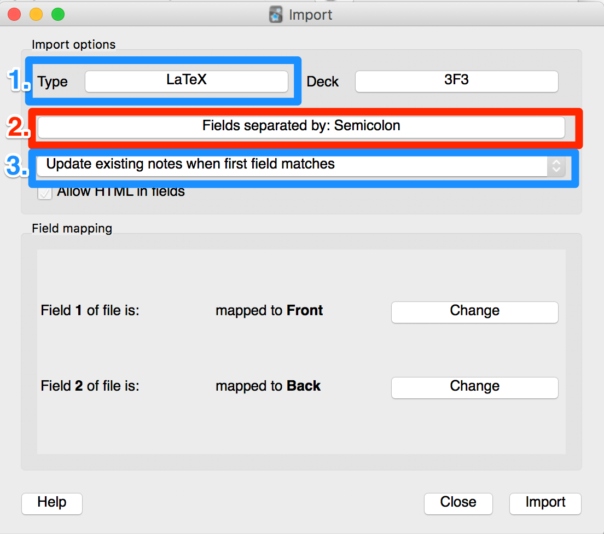

# machine-learning-flashcards
Machine learning flashcards for specific topics, books and courses.

Let me know if you find any errors. Thanks!

### Table of Contents
- `deep-learning-book`: Flashcards based on 'Deep Learning' by Ian Goodfellow, Yoshua Bengio and Aaron Courville.
- `programming-flashcards`: flashcards on algorithms and strategies for tackling algorithms.
- `python-tf-torch`: flashcards on Python, NumPy, TensorFlow and PyTorch.
- `machine-learning/`
    - `intro-to-dl`: Flashcards for David Barber's lectures for UCL's `Intro to Deep learning` course taught in Fall 2018.
    - `reinforcement-learning`: Flashcards based on Reinforcement Learning lectures given by Hado van Hasselt and Matteo Hessel from Deepmind at UCL in Spring 2019.
    - `unsupervised-learning`: Flashcards on the (1) Probabilistic and Unsupervised Learning and (2) Approximate Inferences courses lectured by Maneesh Sahani at the Gatsby Computational Neuroscience Unit, UCL in Fall 2018.
    - `ml-models.tex`: Flashcards on machine learning models.
    - `reinforcement-learning.tex`: flashcards on reinforcement learning.

### How to use the flashcards

#### TEX files

These flashcards are formatted to be used with [Anki](https://apps.ankiweb.net/), the digital flashcard software.

1. Download Anki.
2. Make sure you have LaTeX installed on your computer. 
3. Select the deck you want the cards to be in (or create a new one and select it). 
4. Import the `.tex` file:
    - 
    - File -> Import
    - Select the `.tex` file you want to import.
    - You should see an Anki screen with import options that looks like this.
    - 1. Select the LaTeX card type by clicking on the field to the right of Type.
    - 2. Choose to have fields separated by a semicolon (; char).
        - You should now have two fields in the file.
    - 3. Choose to update existing notes when the first field matches (optional but is generally a good idea).
    - Click 'Import'.
    - There may be some error messages - most of them don't matter but let me know if you see a proper error.
5. Click on the name of the deck and click 'Study Now' to start reviewing the flashcards! :)