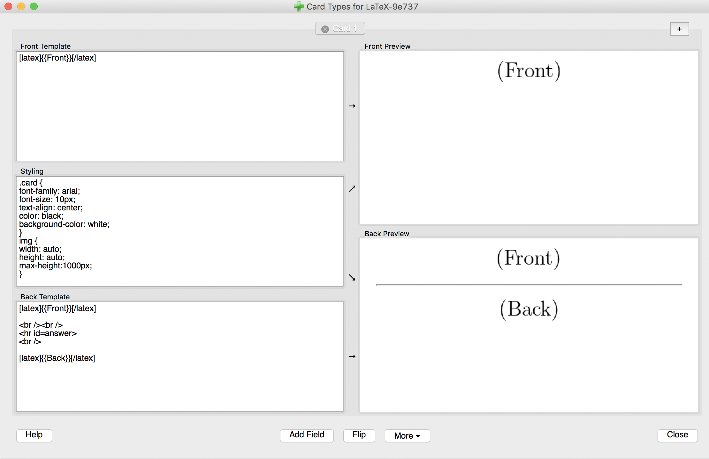

# machine-learning-flashcards
Machine learning flashcards for specific topics, books and courses.

Let me know if you find any errors. Thanks!

### Table of Contents
- `deep-learning-book`: Flashcards based on 'Deep Learning' by Ian Goodfellow, Yoshua Bengio and Aaron Courville.
- `programming-flashcards`: flashcards on algorithms and strategies for tackling algorithms.
- `python-tf-torch`: flashcards on Python, NumPy, TensorFlow and PyTorch.
- `machine-learning/`
    - `intro-to-dl`: Flashcards for David Barber's lectures for UCL's `Intro to Deep learning` course taught in Fall 2018.
    - `reinforcement-learning`: Flashcards based on Reinforcement Learning lectures given by Hado van Hasselt and Matteo Hessel from Deepmind at UCL in Spring 2019.
    - `unsupervised-learning`: Flashcards on the (1) Probabilistic and Unsupervised Learning and (2) Approximate Inferences courses lectured by Maneesh Sahani at the Gatsby Computational Neuroscience Unit, UCL in Fall 2018.
    - `ml-models.tex`: Flashcards on machine learning models.
    - `reinforcement-learning.tex`: flashcards on reinforcement learning.

### How to use the flashcards

#### TEX files

These flashcards are formatted to be used with [Anki](https://apps.ankiweb.net/), the digital flashcard software.

1. Download [Anki](https://apps.ankiweb.net/).
2. Make sure you have LaTeX installed on your computer. 
3. Select the deck you want the cards to be in (or create a new one and select it). 
4. Import the `.tex` file:
    - Go to File -> Import. You should see this window:
    - Select the `.tex` file you want to import.
    - You should see an Anki screen with import options that looks like this:  
        - 1 Select the LaTeX card type by clicking on the field to the right of Type.
            - If you don't have this card type, create one (see 'How to create LaTeX Card Type' below).
            - If you do, you will 99% still have to edit the header of the card type to accommodate for the conditional independence symbols in `lecture-05.tex`. (Step 5 of 'How to create LaTeX Card Type' below.)
        - 2 Choose to have fields separated by a semicolon (; char).
            - You should now have two fields in the file.
        - 3 Choose to update existing notes when the first field matches (optional but is generally a good idea).
    - Click 'Import'.
    - There may be some error messages - most of them don't matter but let me know if you see a proper error.
5. Click on the name of the deck and click 'Study Now' to start reviewing the flashcards! :)

#### How to create a LaTeX card type

1. From the Anki launch page, click 'Add'. If you are already in a window where you can select the card type, skip this step.
2. Click on the card type.
3. You should see a list of card types. Click 'Manage'.
4. Click 'Add'.
5. Click 'Clone: Basic' and name the card type as 'LaTeX' (or whatever else you want). (Or if you don't have Basic, cloning another card type should also work - Basic is just the most basic (!) card type.) 
6. Select the card type you just created. Click 'Options' and add the following to the header:
    - ```\documentclass[12pt]{article} \usepackage{amssymb,amsmath,amsfonts,mathrsfs, graphicx} \usepackage[paperwidth=5in, paperheight=100in]{geometry} \pagestyle{empty} \setlength{\parindent}{0in}
\newcommand{\indep}{\perp\!\!\!\perp}

\newcommand{\CI}{\mathrel{\text{\scalebox{1.07}{$\perp\mkern-10mu\perp$}}}}

\newcommand{\nCI}{\centernot{\CI}}
\begin{document} 
    ```
    - If you already have a header, you can add the following if you plan to import  Unsupervised Learning Lecture 5 (Graphical models):
    - ```\newcommand{\indep}{\perp\!\!\!\perp}

\newcommand{\CI}{\mathrel{\text{\scalebox{1.07}{$\perp\mkern-10mu\perp$}}}}

\newcommand{\nCI}{\centernot{\CI}}```
    - Add the following footer:
        ```\end{document}```
7. You should be back where you are choosing a card type. (To get to this window, click on the card type name from the window where you are adding cards.) Click on your new card type and click 'Choose.'
8. Click 'Cards...'. You should see something like: 
    - 
10. Replace the front template with
    - ```[latex]{{Front}}[/latex] ```
    - and the back template with
    - ```[latex]{{Front}}[/latex]

<br /><br />
<hr id=answer>
<br />

[latex]{{Back}}[/latex] ```
9. Click 'Close'. You're done! Just select this card type when you're importing cards in future.
